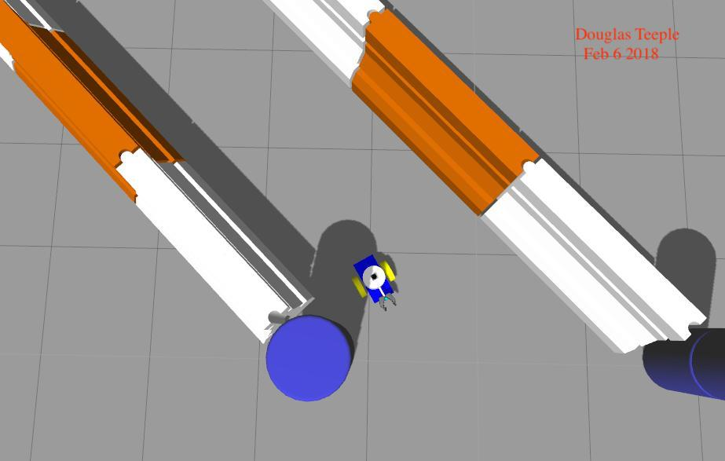
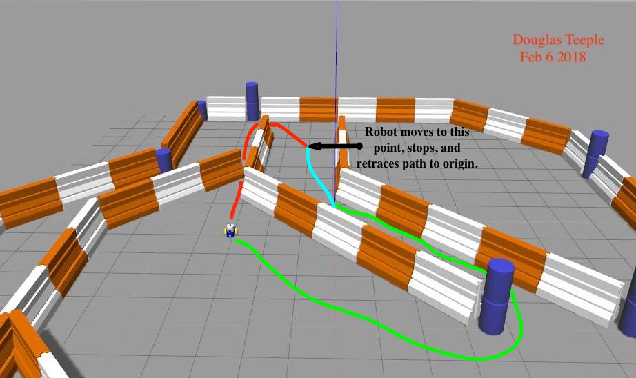

# Robot Localization
## Udacity Term 2 RoboND Localization Project

### Abstract
This project is the creation and testing of two robot simulations in a ROS (Robot Operating System) / Gazebo / RViz simulation environment. Both robots use Adaptive Monte Carlo Localization techniques combined with a navigation plugin to successfully navigate a maze to reach a predefined goal position. The two robot designs are compared for efficiency in reaching the goal.

### Introduction
Localization in robotics means determining a good approximation of the current position of a robot given uncertainties of noisy sensors such as a camera or Lidar (Light Detection and Ranging) and uncertainties due to imperfect actuators moving the robot.

Two robots were developed and tested in a simulation environment. The robots successfully navigated the maze using the Adaptive Monte Carlo Localization (AMCL) algorithm. The benchmark definition of one of the robots was given as part of the project, while the second was created independently. The benchmark robot is called ’UdacityBot’ and the second robot designed for this project is called ’DougBot’ throughout this paper. DougBot used the Willow Garage [1] PR2 gripper URDF definition as described in a ROS.org Wiki [2]. The world definition uses a map created by ’jackal race’ was developed by Clearpath Robotics [3].

### RESULTS
DougBot navigated the same path as UdacityBot. The difference in mass had no effect on time to reach the goal.

#### Localization Results

##### Benchmark - UdacityBot
The time taken to reach the goal was 14 minutes. At no time did the robot collide with a barrier. The maximum number of particles was reduced from 5000 to 200 to meet computational constraints of the deployment environment (NVidia Jetson TX2).

##### Student - DougBot
The time taken to reach the goal was 14 minutes. At no time did the robot collide with a barrier. The maximum number of particles was reduced from 5000 to 200 to meet computational constraints of the deployment environment (NVidia Jetson TX2).

#### Technical Comparison
DougBot is considerably heavier than the benchmark Udac- ityBot. The laser Scanner is placed higher than UdacityBot atop the tower of DougBot and more towards the rear.

### DISCUSSION
Both robots performed equally well. DougBot is considerably heavier than the benchmark UdacityBot, though the extra mass did not significantly change the time to reach the goal. Perhaps this is due to the fact that friction of the wheels is set to maximum so there is no slippage. This assumption does not reflect real world conditions, where slippage of one wheel may well be quite common, and the difference in mass would then become important.

The Laser Scanner placement modification also had no impact on performance in the given environment as the scanner was still lower than the height of the barriers. Had the barriers been lower or of uneven height DougBot may well have collided with a barrier.
The route taken was circuitous and suboptimal. 

The route is as shown:

The turquoise line section shows the initial route taken. Apparently the navigation module was trying to take the shorter red route to the goal, but eventually decided that the gap between walls was too narrow to navigate, so turned around and took the green route to the goal. This error in navigation was the main reason that the robots took 14 minutes to reach the goal.

### Topics

• Both robots performed performed equally well.

• AMCL does not work well for the kidnapped robot
problem.

• The scenario that needs to be accounted for in the
kidnapped robot problem is one of abruptly disappearing from one location and showing up in another.

• MCL/AMCL would work well in any industry domain where clear barriers guide the path of the robot. The ground also needs to be flat and clear of obstacles particularly in the case of DougBot where the Laser Scanner is placed on top of the tower.

### CONCLUSION / FUTURE WORK
Both robots reached the goal in the same length of time. Both robots were equally capable of avoiding collisions with the barriers, indicating that localization was working well. The main factor in the time it took to reach the goal was the navigation algorithm. The major contributing factor to the extended time to reach the goal was an error in navigation. This project focused on localization, not navigation.

So, while both robots reached the goal, the circuitous route would mean neither robot model could be applied to commercial products.
Placement of the Laser Scanner at the top of the tower of DougBot may have negative effects if the robot were not on a completely flat surface as is the case in this simulation, but could cause DougBot to miss lower items such as debris should it be present, and to get stuck in the debris.

Future work to make the robots commercially viable would be in working on improving the navigation planner.

### Hardware Deployment
The two project models are deployed on a Jetson TX2 board running ROS and Ubuntu 16.04 Linux. Experience shows that this hardware configuration has adequate processing power both in CPU power and memory to host the model.
The models were simulated in Gazebo and RViz only, and no drivers were implemented to actuate drive motors or read sensors. The TX2 prototype board has a camera which could be connected into the model. A laser scanner would have to be inte- grated in order for a hardware version to operate. It would also need connections to drive wheels and be implemented on a suitable platform.

## References
[1] WillowGarage, “Willow garage home page.” https://www.willowgarage.com, 2018.

[2] ROS.ORG,“Buildingavisualrobotmodelwithurdffromscratch.” http://wiki.ros.org/urdf/Tutorials/Building%20a%20Visual%20Robot%20Model%20with%20URDF%20from%20Scratch, 2018.

[3] ClearPathRobotics,“Clearpathroboticshomepage.”https://www.clearpathrobotics.com, 2018.

[4] Hokuyo, “Hokuyo laser scanner home page.” https://www.hokuyo-aut.jp, 2018.

[5] Wikipedia, “Holonomic constraint.” https://en.wikipedia.org/wiki/Holonomicconstraints, 2018.

[6] D. Teeple, “Github robond localization project.” https://github.com/douglasteeple/RobotLocalization, 2018.

